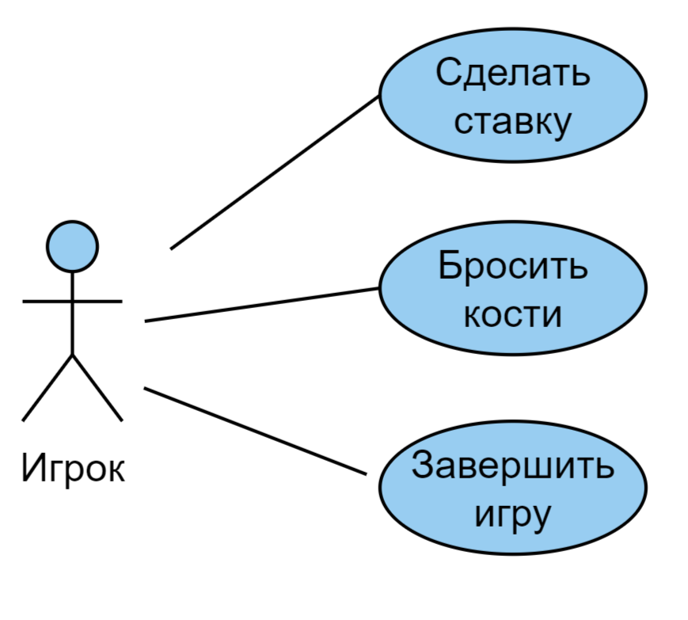

# Прецедент "Выбор ставки"

|                      | Выбор ставки                                                        |
| -------------------- | ------------------------------------------------------------------- |
| Название             | Выбор ставки                                                        |
| Описание             | Игрок выбирает понравившиеся сектора и ставит на них сумму на выбор |
| Основной исполнитель | Игрок                                                               |
| Предусловия          | Ненулевой баланс на счёте игрока                                    |
| Постусловия          | -                                                                   |

## Основной успешный сценарий

| Действие актора                                | Реакция системы              |
| ---------------------------------------------- | ---------------------------- |
| Игрок увеличивает (уменьшает) ставку на сектор | Ставка увеличена (уменьшена) |
|                                                | Запоминает ставку игрока     |

## Альтернативные сценарии

| Действие актора                                | Реакция системы                                                                                |
| ---------------------------------------------- | ---------------------------------------------------------------------------------------------- |
| Игрок увеличивает (уменьшает) ставку на сектор | Если у игрока недостаточно средств, предупреждает его и заканчивает игру, показывает результат |

# Прецедент "Бросок костей"

|                      | Бросок кубика                            |
| -------------------- | ---------------------------------------- |
| Название             | Бросок кубика                            |
| Описание             | Игрок бросает кости, узнаёт свой выигрыш |
| Основной исполнитель | Игрок                                    |
| Предусловия          | Выполнена ставка хотя бы на один сектор  |
| Постусловия          | -                                        |

## Основной успешный сценарий

| Действие актора          | Реакция системы                                                                  |
| ------------------------ | -------------------------------------------------------------------------------- |
| Игрок подбрасывает кости | Система показывает значение, выпавшее на костях и на рассчитывает выигрыш игрока |

# Прецедент "Завершение игры"

|                      | Завершение игры                                        |
| -------------------- | ------------------------------------------------------ |
| Название             | Завершение игры                                        |
| Описание             | Игрок завершает игру, система показывает его результат |
| Основной исполнитель | Игрок                                                  |
| Предусловия          | Ненулевой баланс на счёте игрока                       |
| Постусловия          | -                                                      |

## Основной успешный сценарий

| Действие актора      | Реакция системы                                                                      |
| -------------------- | ------------------------------------------------------------------------------------ |
| Игрок завершает игру | Спрашивает, действительно ли игрок хочет завершить игру. Показывает результат игрока |

## Альтернативный сценарий

| Действие актора      | Реакция системы                                                                                                                                 |
| -------------------- | ----------------------------------------------------------------------------------------------------------------------------------------------- |
| Игрок завершает игру | Спрашивает, действительно ли игрок хочет завершить игру. Если игрок сделал выбор случайно, даёт возможность сделать ставку или подбросить кости |
